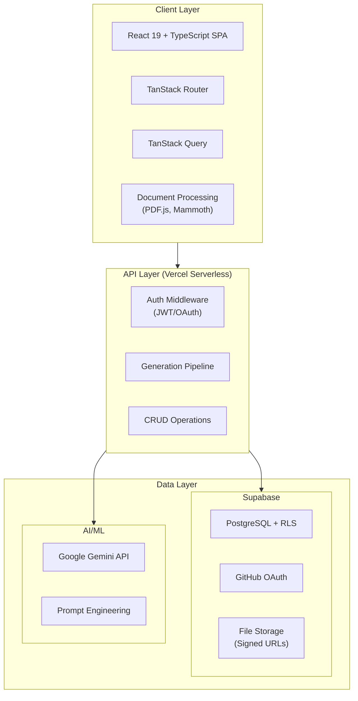
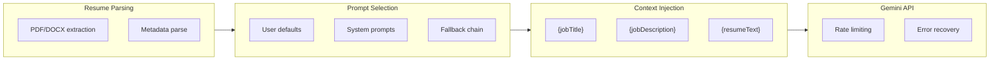

# Pare

**AI-Powered Cover Letter Generation Platform**

A production-grade SaaS application that leverages Google's Gemini LLM to generate personalized, context-aware cover letters by analyzing resume content and job descriptions through sophisticated prompt engineering.

[Live Demo](https://pare-one.vercel.app)

---

## System Architecture



---

## ML/AI Implementation



| Feature | Implementation |
|---------|---------------|
| **Model** | Google Gemini `gemma-3-12b-it` - free-tier API with 32k context window, enabling zero-cost generation with full resume + job description context |
| **Prompt Engineering** | Template-based system with dynamic variable injection |
| **Custom Prompts** | User-defined templates with fallback chain resolution |
| **Rate Limiting** | Graceful handling of API limits with user feedback |

---

## Technology Stack

### Frontend
| Technology | Purpose |
|------------|---------|
| React 19 + TypeScript | Type-safe component architecture |
| Vite | Sub-second HMR, optimized builds |
| TanStack Router | File-based routing with code-splitting |
| TanStack Query | Server state synchronization |
| Tailwind CSS + shadcn/ui | Utility-first styling with accessible components |

### Backend
| Technology | Purpose |
|------------|---------|
| Vercel Serverless | Edge-optimized, auto-scaling compute |
| Express 5 + Zod | Request routing with runtime validation |
| Google GenAI SDK | LLM API integration |
| pdf-parse, mammoth | Document text extraction |

### Data Layer
| Technology | Purpose |
|------------|---------|
| Supabase PostgreSQL | ACID-compliant storage with Row-Level Security |
| Supabase Auth | GitHub OAuth with JWT tokens |
| Supabase Storage | S3-compatible blob storage with signed URLs |

---

## Key Features

| Feature | Description |
|---------|-------------|
| **AI Generation** | Context-aware cover letters using resume + job description analysis |
| **Resume Parsing** | Automatic text extraction from PDF and DOCX formats |
| **Custom Prompts** | User-defined prompt templates with variable injection |
| **Multi-Format Export** | Download as PDF, DOCX, or copy to clipboard |
| **Template Management** | Save, edit, and organize generated cover letters |
| **Anonymous Mode** | Generate cover letters without authentication |

---

## Development

### Prerequisites
- Node.js 18+ and Yarn
- Supabase account
- Google AI (Gemini) API key

### Setup

```bash
# Install dependencies
cd frontend && yarn install
cd ../api && yarn install

# Start frontend dev server
cd frontend && yarn dev

# Start API with Vercel CLI (from root)
vercel dev
```


---

## Roadmap

- [ ] Multi-provider LLM support (OpenAI, Anthropic)
- [ ] Bring-your-own API key option
- [ ] Browser extension for one-click generation

---

## License

MIT License
