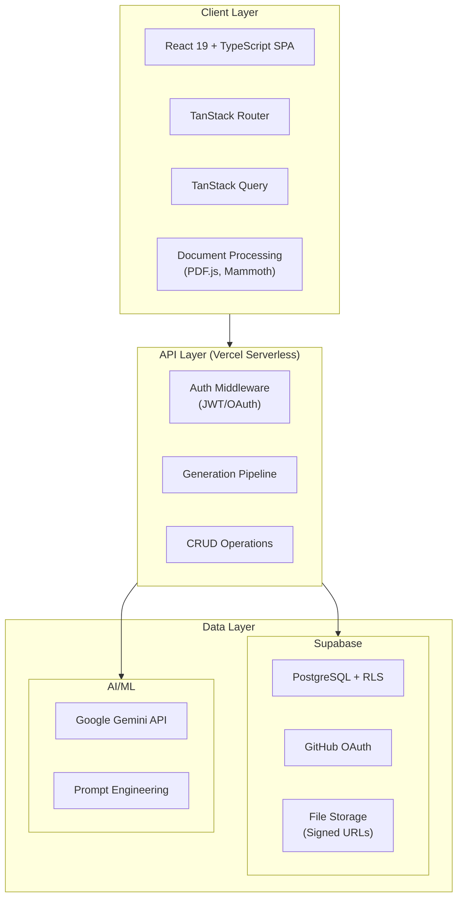
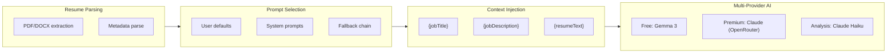

# Pare

**AI-Powered Cover Letter Generation Platform**

A production-grade SaaS application that leverages Google's Gemini LLM to generate personalized, context-aware cover letters by analyzing resume content and job descriptions through sophisticated prompt engineering.

[Live Demo](https://pare-eight-sage.vercel.app)

---

## System Architecture


```mermaid
flowchart TB
    subgraph Client["Client Layer"]
        SPA["React 19 + TypeScript SPA"]
        Router["TanStack Router"]
        Query["TanStack Query"]
        DocProc["Document Processing<br/>(PDF.js, Mammoth)"]
    end

    subgraph API["API Layer (Vercel Serverless)"]
        Auth["Auth Middleware<br/>(JWT/OAuth)"]
        Gen["Generation Pipeline"]
        CRUD["CRUD Operations"]
    end

    subgraph Data["Data Layer"]
        subgraph Supabase["Supabase"]
            DB["PostgreSQL + RLS"]
            OAuth["GitHub OAuth"]
            Storage["File Storage<br/>(Signed URLs)"]
        end
        subgraph AI["AI/ML"]
            Gemini["Google Gemini API"]
            Prompts["Prompt Engineering"]
        end
    end

    Client --> API
    API --> Supabase
    API --> AI
```

---

## ML/AI Implementation


```mermaid
flowchart LR
    subgraph Parse["Resume Parsing"]
        P1["PDF/DOCX extraction"]
        P2["Metadata parse"]
    end

    subgraph Prompt["Prompt Selection"]
        PR1["User defaults"]
        PR2["System prompts"]
        PR3["Fallback chain"]
    end

    subgraph Context["Context Injection"]
        C1["{jobTitle}"]
        C2["{jobDescription}"]
        C3["{resumeText}"]
    end

    subgraph LLM["Multi-Provider AI"]
        L1["Free: Gemma 3"]
        L2["Premium: Claude (OpenRouter)"]
        L3["Analysis: Claude Haiku"]
    end

    Parse --> Prompt --> Context --> LLM
```

| Feature | Implementation |
|---------|---------------|
| **Free Tier** | Google Gemini `gemma-3-12b-it` - zero-cost generation with 32k context window |
| **Premium Tier** | Bring-your-own OpenRouter API key + Claude 3.5 Sonnet (~$0.01-0.05/letter, user-paid) |
| **Job Analysis** | Claude 3.5 Haiku for structured JD parsing (~$0.0001/analysis, premium only) |
| **Prompt Engineering** | Template-based system with dynamic variable injection |
| **Custom Prompts** | User-defined templates with fallback chain resolution |
| **API Key Security** | PostgreSQL pgcrypto encryption for user API keys |

---

## Technology Stack

### Frontend
| Technology | Purpose |
|------------|---------|
| React 19 + TypeScript | Type-safe component architecture |
| Vite | Sub-second HMR, optimized builds |
| TanStack Router | File-based routing with code-splitting |
| TanStack Query | Server state synchronization |
| Tailwind CSS + shadcn/ui | Utility-first styling with accessible components |

### Backend
| Technology | Purpose |
|------------|---------|
| Vercel Serverless | Edge-optimized, auto-scaling compute |
| Express 5 + Zod | Request routing with runtime validation |
| Google GenAI SDK | LLM API integration |
| pdf-parse, mammoth | Document text extraction |

### Data Layer
| Technology | Purpose |
|------------|---------|
| Supabase PostgreSQL | ACID-compliant storage with Row-Level Security |
| Supabase Auth | GitHub OAuth with JWT tokens |
| Supabase Storage | S3-compatible blob storage with signed URLs |

---

## Pricing Tiers

### Free Tier
- **Model:** Gemma 3 (12B parameters)
- **Cost:** $0 to users and platform
- **Features:** Basic cover letter generation
- **Requirements:** No API key needed

### Premium Tier
- **Model:** Claude 3.5 Sonnet via OpenRouter
- **Cost:** ~$0.01-0.05 per cover letter (paid by user to OpenRouter)
- **Features:**
  - Advanced cover letter generation with Claude
  - Job description analysis with Claude Haiku
  - ATS keyword extraction
  - Culture and tone analysis
- **Requirements:** User's own OpenRouter API key

---

## Key Features

| Feature | Description |
|---------|-------------|
| **AI Generation** | Context-aware cover letters using resume + job description analysis |
| **Two-Tier System** | Free tier (Gemma) and premium tier (bring-your-own OpenRouter key) |
| **Job Description Analysis** | Structured parsing of JD for ATS keywords, skills, and culture signals (premium) |
| **Resume Parsing** | Automatic text extraction from PDF and DOCX formats |
| **Custom Prompts** | User-defined prompt templates with variable injection |
| **API Key Management** | Secure encrypted storage of user API keys with PostgreSQL pgcrypto |
| **Multi-Format Export** | Download as PDF, DOCX, or copy to clipboard |
| **Template Management** | Save, edit, and organize generated cover letters |

---

## Development

### Prerequisites
- Node.js 18+ and Yarn
- Supabase account
- Google AI (Gemini) API key (optional - for free tier only)
- OpenRouter API key (optional - users bring their own for premium tier)

### Setup

```bash
# Install dependencies
cd frontend && yarn install
cd ../api && yarn install

# Start frontend dev server
cd frontend && yarn dev

# Start API with Vercel CLI (from root)
vercel dev
```


---

## Roadmap

- [x] Multi-provider LLM support (OpenRouter with Claude)
- [x] Bring-your-own API key option
- [ ] Resume tailoring feature (see plan file)
- [ ] Browser extension for one-click generation
- [ ] Additional providers (OpenAI, direct Anthropic)

---

## License

MIT License
